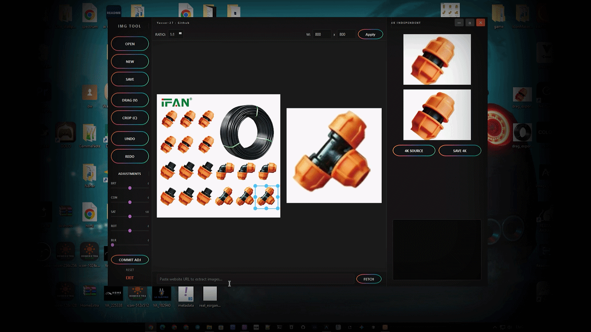
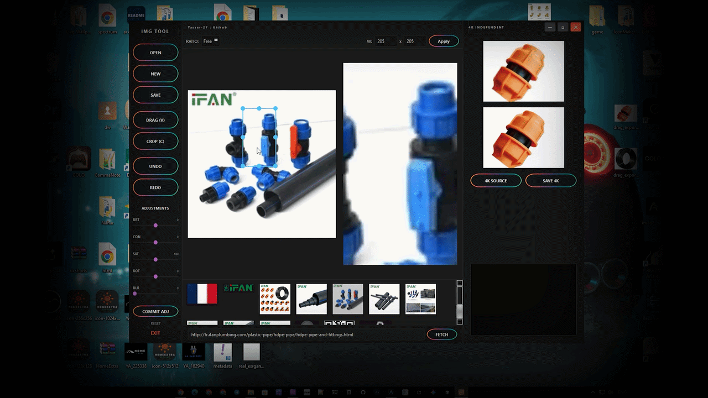
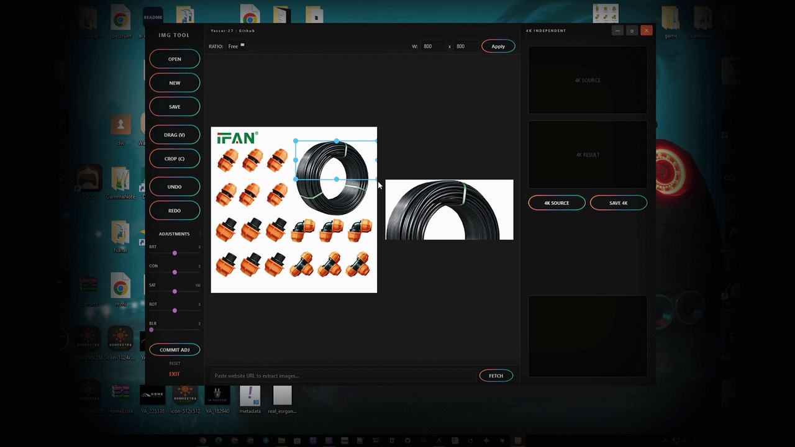
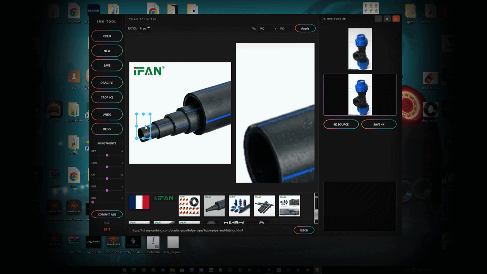
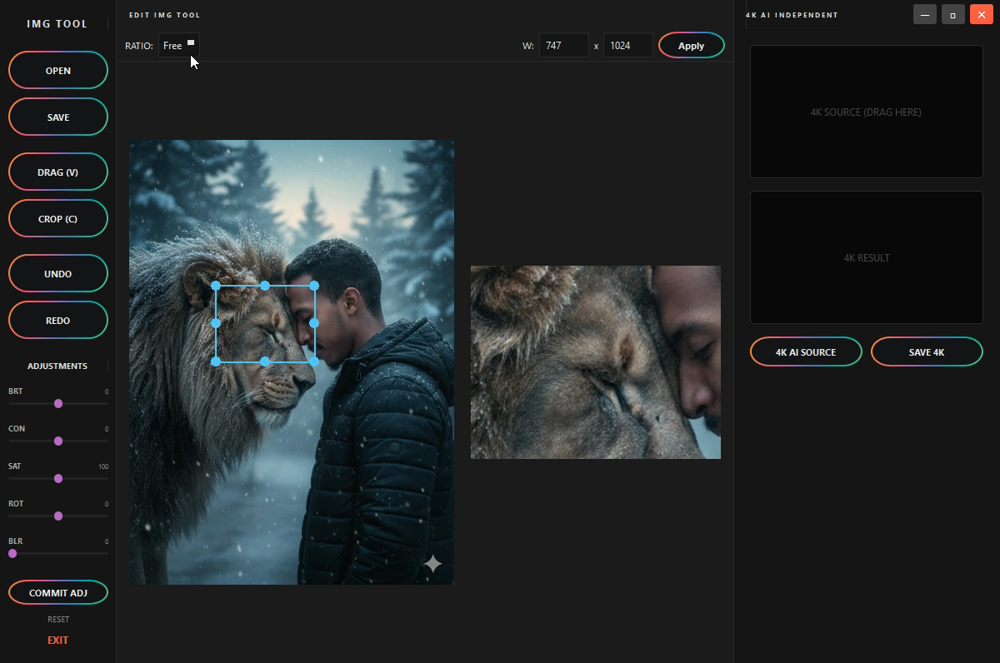
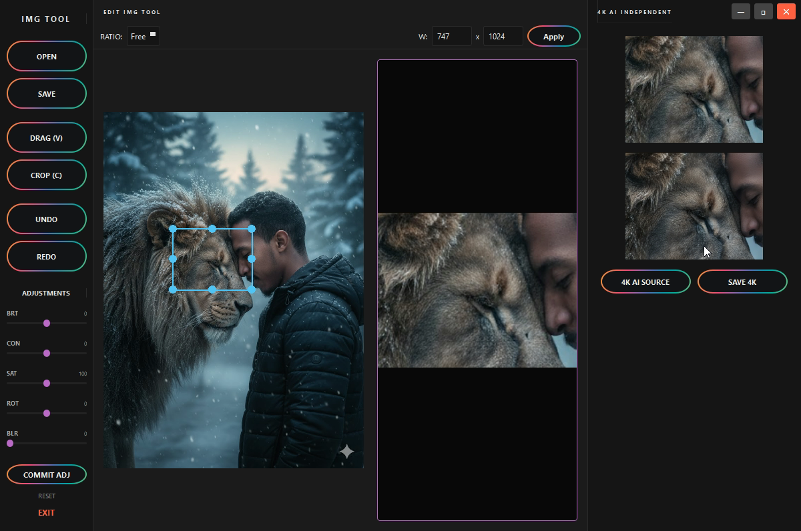

#  Edit Img Tool

  
   
  <b>A lightweight, fast, and powerful image editing utility for PC.</b>

  
  

##  Overview
>**Edit Img Tool** is designed to provide a seamless experience for quick image modifications. Whether you need to crop an image or enhance its quality to 4K, this tool handles it with speed and simplicity.

##  Features in V2.0.0
* **Smart Crop:** Easily select and crop the areas you need.
* **AI Enhancement (Clear V2):** Fix blurry images and upgrade them to **4K resolution**.
* **Improved Workflow:** Faster processing and cleaner UI.
* **Bug Fixes:** Resolved the "duplicate filename" issue from V1.

## Screenshots
## V2.0.0

| crop | Clear v1 |
|---|---|
| | |

---
Precision Cropping
 
4K Resolution  
 

🛠 Changelog
Version 2.0.0 (Latest)
Fixed: The output naming conflict (V1 used to overwrite files with the same name).
Added: Advanced 4K resolution upscaling.
Improved: Multi-format support and processing speed.
Version 1.0.0
Initial release with basic crop and clear functions.
---
## Screenshots
> v1.00 good but have one problem  : same name output 

| Image | Image |
|---|---|
|  | |
---

👤 Developer
Created with ❤️ by Yasser-27.


If you find this tool helpful, don't forget to star the repository! ⭐

